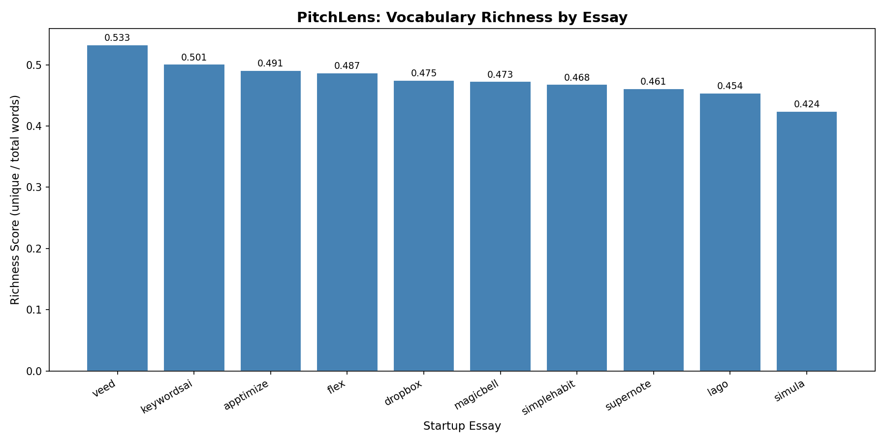
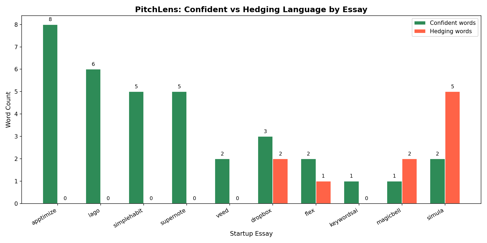

# PitchLens

A Python text analysis tool that analyzes language patterns in real YC startup
application essays to find what writing traits successful pitches share.

## What I Analyzed

10 real YC startup application essays across different industries:

| Essay | Company | Category |
|---|---|---|
| apptimize.txt | Apptimize | Mobile dev tools |
| dropbox.txt | Dropbox | File sync |
| flex.txt | FLEX | Consumer product |
| keywordsai.txt | Keywords AI | AI/LLM tools |
| lago.txt | Lago | B2B SaaS |
| magicbell.txt | MagicBell | Developer tools |
| simplehabit.txt | Simple Habit | Consumer / wellness |
| simula.txt | Simula | VR / open source |
| supernote.txt | Supernote | Data science tools |
| veed.txt | VEED | Media / video editing |

## Questions I Asked

**Q1: Which startup has the richest vocabulary?**
Measured as unique words divided by total words. A higher score means the
essay uses a wider variety of language.

**Q2: Which startups use more confident vs hedging language?**
Counted confident words (will, built, launched, proven, achieved...) vs
hedging words (might, maybe, perhaps, hope, possibly...) and computed a score.

## What I Found

### Vocabulary Richness


All essays scored between 0.42 and 0.53 — a surprisingly tight range.
VEED ranked highest (0.533) and Simula ranked lowest (0.424). Most essays
cluster around 0.46–0.50, which suggests successful YC pitches tend to be
focused and concise rather than vocabulary-heavy.

### Confidence vs Hedging Language


| Essay | Confident | Hedging | Score |
|---|---|---|---|
| apptimize | 8 | 0 | **+8** |
| lago | 6 | 0 | **+6** |
| simplehabit | 5 | 0 | **+5** |
| supernote | 5 | 0 | **+5** |
| veed | 2 | 0 | +2 |
| dropbox | 3 | 2 | +1 |
| flex | 2 | 1 | +1 |
| keywordsai | 1 | 0 | +1 |
| magicbell | 1 | 2 | -1 |
| simula | 2 | 5 | **-3** |

Most essays lean confident. Simula scored -3, the only strongly hedging essay —
which makes sense since it was an early-stage open source VR project with a lot
of speculation about the future.

## What Surprised Me

- Vocabulary richness was almost the same across all 10 essays. I expected
  more variation between different types of startups.
- Simula was the only essay with negative confidence score. Its top words
  included "think" and "believe" a lot, which matches its speculative tone.
- Each essay's top words almost perfectly described what the company does —
  even without any context, you could guess the product just from the word list.

## How to Run

1. Add YC essay `.txt` files to the `data/` folder
2. Install dependencies:
```
pip install matplotlib
```
3. Run the analysis:
```
python pythonanalysis.py
```

## Project Structure

```
PitchLens/
├── data/                     # YC essay .txt files
├── pythonanalysis.py         # Main analysis script
├── vocabulary_richness.png   # Chart 1 output
├── confidence_scores.png     # Chart 2 output
├── PROPOSAL.md
└── README.md
```

## What I Practiced

- String methods: split, lower, translate
- Dictionaries for word counting and frequency tables
- File I/O: reading multiple .txt files from a folder
- Data cleaning: stop words, punctuation removal
- Functions and code organization
- Matplotlib: bar charts and grouped bar charts

## Author

Spark — OIM3640 Spring 2026